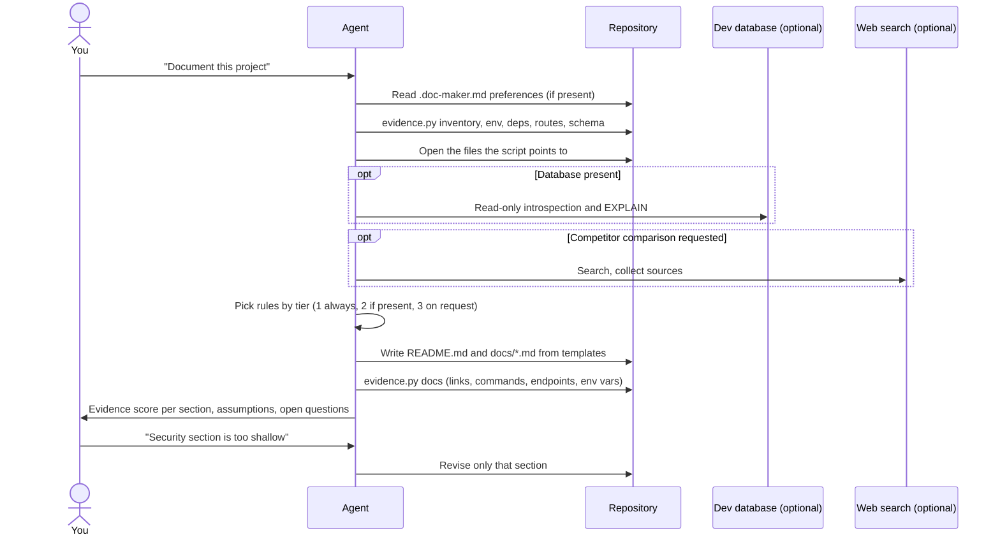
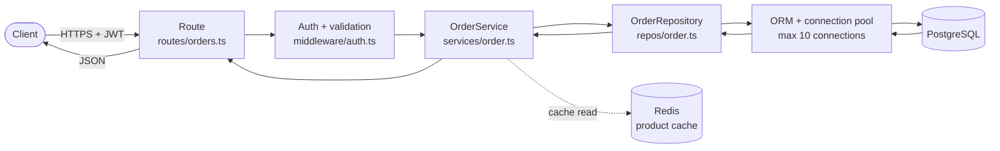
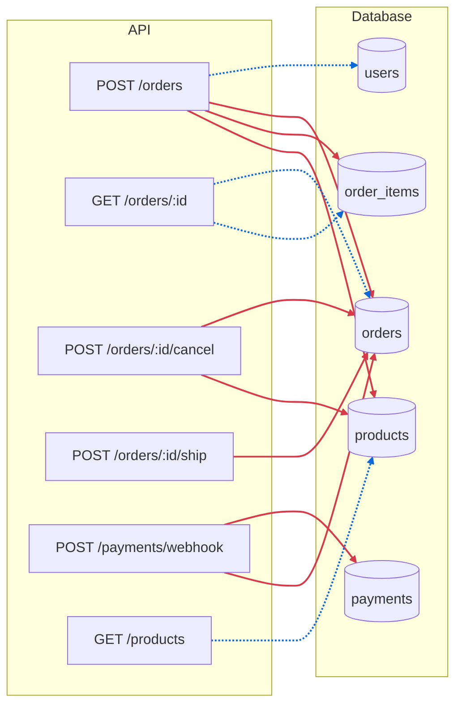
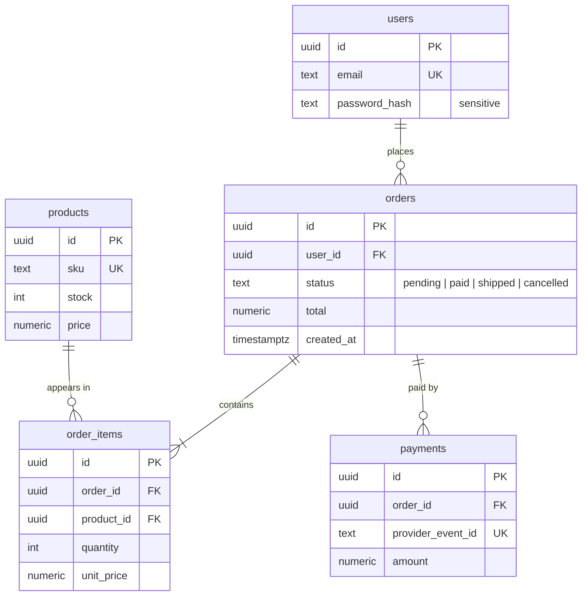
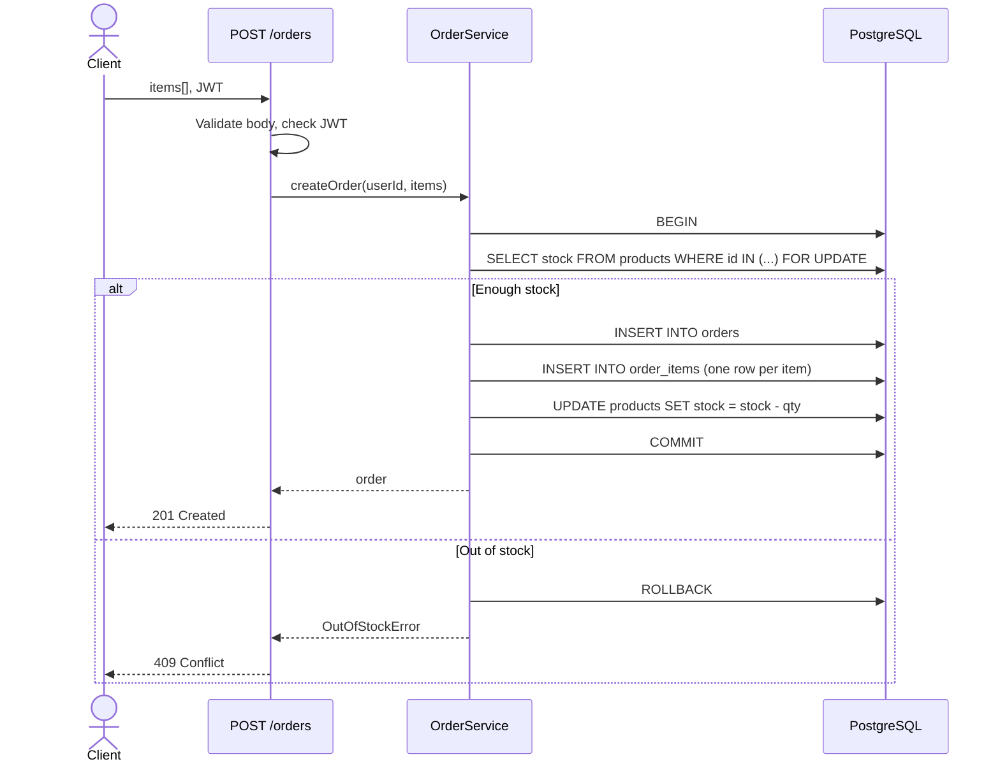
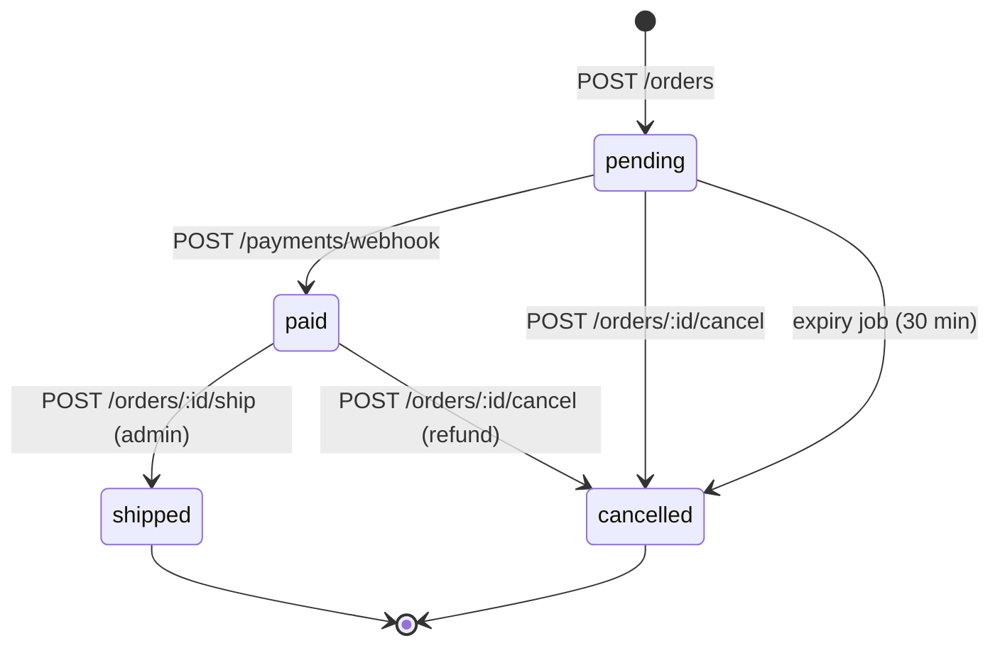

# Doc Maker guide

This guide shows how to get good documentation out of the `doc-maker`, `database-docs` and `architecture-docs` skills: how they are triggered, what to ask for, how to review the result, and how to change the rules. For installation, see the [README](README.md#install).

## Contents

1. [How the skills are triggered](#1-how-the-skills-are-triggered)
2. [What happens during a run](#2-what-happens-during-a-run)
3. [Prompt recipes](#3-prompt-recipes)
4. [Choose the audience](#4-choose-the-audience)
5. [Control the output](#5-control-the-output)
6. [Database documentation](#6-database-documentation)
7. [Review the result](#7-review-the-result)
8. [Keep docs up to date](#8-keep-docs-up-to-date)
9. [Feedback and preferences](#9-feedback-and-preferences)
10. [The evidence script](#10-the-evidence-script)
11. [Rule index](#11-rule-index)
12. [Customize the rules](#customize-the-rules)
13. [Troubleshooting](#13-troubleshooting)

---

## 1. How the skills are triggered

An agent loads only each skill's name and description at startup. When your request matches a description, the agent reads the full `SKILL.md` and follows it.

| Skill | Triggers on requests such as |
|-------|------------------------------|
| `doc-maker` | "document this project", "write / rewrite the README", "check our docs against the code", "write developer / product / executive docs". **Not** plain questions such as "how does auth work here?" |
| `database-docs` | "ER diagram", "document the schema", "data dictionary", "document the database", or when `doc-maker` finds a database |
| `architecture-docs` | "threat model", "role-permission matrix", "document our CI/CD / deployment / infrastructure", "sequence diagrams", "disaster recovery", "cost breakdown", "technical debt", or when `doc-maker` needs architecture or operations depth |

You can also call a skill directly:

| Install method | Command |
|----------------|---------|
| Plugin | `/doc-maker:doc-maker`, `/doc-maker:database-docs`, `/doc-maker:architecture-docs` |
| Manual copy or `npx skills` | `/doc-maker`, `/database-docs`, `/architecture-docs` |

Add your request after the command, for example `/doc-maker write a README for new contributors`.

---

## 2. What happens during a run



Expect the agent to collect evidence before it writes anything. On a large repository, a full documentation set can take several minutes.

---

## 3. Prompt recipes

Copy a prompt and adjust it. Specific prompts give better results than "write docs".

### README only

```text
Write a README for this repository. Audience: developers who want to run it locally
in under 10 minutes. Keep it to one file.
```

### Full documentation set

```text
Create a full documentation set for this project: README plus focused docs under docs/.
Audience: a developer joining the team next week.
```

### Architecture only

```text
Write docs/ARCHITECTURE.md: components, how a request flows from input to output,
why each major component exists, and a sequence diagram for the main flow and one
failure flow.
```

### Design decisions (ADRs)

```text
Find the 5 most important engineering decisions in this codebase and write them as
ADRs in docs/DECISIONS.md. Use evidence from the code and git history.
```

### Competitor comparison

```text
Compare this project with its main alternatives in docs/COMPARISON.md. Use web search,
cite every source, and keep verified facts separate from your interpretation.
```

### Security review for docs

```text
Document authentication, authorization, secrets handling, input validation and the
main security risks with mitigations. Don't print any real secrets you find; list
the file and line instead.
```

### AI/ML project

```text
Document the ML pipeline in docs/ML.md: data sources, preprocessing, models, prompts,
evaluation method, hallucination risks and fallbacks. Say which metrics were actually
measured and which are not.
```

### Threat model and access control

```text
Write docs/SECURITY.md: the authentication and authorization model with sequence
diagrams, a role-permission matrix derived from the code, and a STRIDE threat model
with trust boundaries, mitigations and gaps. Reference secrets by file and line only.
```

### Infrastructure and delivery

```text
Write docs/INFRASTRUCTURE.md from our Dockerfiles, IaC and CI config: deployment
architecture, cloud resources, environments and how they differ, the CI/CD pipeline
from commit to production, and the rollback procedure.
```

### Disaster recovery runbook

```text
Document disaster recovery: state our RTO/RPO or say none are defined, list the
backups and replication that actually exist, and write step-by-step runbooks for
database loss, a bad deploy and leaked credentials. Mark recommendations separately.
```

### Cost and scaling

```text
Document our cost drivers and scalability strategy. Map each cost to the component
and billing unit, use dated official prices, and give formulas where usage is unknown.
Describe what breaks first at 10x and 100x load.
```

### Technical debt and future architecture

```text
Analyze technical debt and performance bottlenecks with file locations, impact, risk
and effort. Then propose a target architecture as a "proposed" diagram, with
incremental migration steps and ADRs for the big decisions.
```

### Keep docs in sync with code

```text
Create docs/MAINTAINING_DOCS.md that maps code areas to the docs that must change
with them, plus a pull-request checklist. Suggest CI checks we could add.
```

### Onboarding checklist

```text
Write a "first day" section in the README: prerequisites, setup, environment variables,
how to run tests, and fixes for the 5 most likely setup failures.
```

---

## 4. Choose the audience

State the audience in your request. The skill changes depth and emphasis to match.

| Audience | Emphasis | Typical length |
|----------|----------|----------------|
| **Developers** | Precise setup, architecture, APIs, data flow, tests, failure handling | Long, many code blocks and diagrams |
| **Product / business** | Problems solved, users, workflows, value, limitations | Medium, few code blocks |
| **Executives** | Business impact, high-level architecture, risks, strategic choices | Short, high-level diagrams only |
| **Open-source users** | What it is, why use it, install, quick start, examples, contributing | README first |

The agent tells you which audience it assumed when it hands the docs over. Correct it if that's wrong.

---

## 5. Control the output

Useful instructions to add to any prompt:

| You want | Add |
|----------|-----|
| One file only | "Keep everything in README.md." |
| A specific folder | "Write to `docs-draft/` and don't touch existing files." |
| Existing style | "Follow the conventions in the existing `docs/` folder." |
| Fewer sections | "Skip roadmap and competitor analysis." |
| A specific section | "Include a troubleshooting section." |
| No diagrams | "No Mermaid diagrams." |
| Plan first | "List the documents and sections you plan to write, and wait for my approval." |
| Documentation site | "Structure docs for MkDocs / Docusaurus with a sidebar config." |

---

## 6. Database documentation

`database-docs` works best when it can see every source of truth:

- Schema or DDL files, migrations, and ORM models
- Raw SQL and data-access code
- Configuration (connection settings, pool sizes) — with secrets left out
- A **local or staging** database, if you want live introspection

When a schema file, the live database and the code disagree (for example, a foreign key in the ORM that isn't in the database), the skill reports the difference instead of picking one. Relationships that the code relies on but the database doesn't enforce are labelled "logical, not enforced" in the ER diagram.

> [!WARNING]
> Don't give the agent production database credentials. The skill is written to stay read-only, but the safe setup is a development copy with no real personal data.

Example:

```text
Document our database in docs/DATABASE.md. Use the migrations in db/migrations and the
models in app/models. Include an ER diagram, a data dictionary with sensitivity labels,
and the indexes each important query uses.
```

### Example output: API ↔ database documentation

This is what rules DB3, DB10, A4 and A5 produce together. The project below is a **made-up shop API** used only to show the format; on your project, every box, table and arrow comes from your real routes, models and migrations.

Prompt:

```text
Document how our API maps to the database: request path through the layers, which
endpoints read and write which tables, the transaction for placing an order, and the
order status lifecycle.
```

#### 1. Request path through the layers (DB10)

How one request travels from the API to the database and back, with the code location of each layer.



#### 2. Which endpoints touch which tables (DB10)

**Red** arrows write, **blue** arrows only read. Tables that many endpoints write to (here `orders`) are where most bugs and lock contention hide. The table underneath gives the detail for each arrow.



The same mapping as a table, which is easier to review in a pull request:

| Endpoint | Method | Reads | Writes | Transaction | Notes |
|----------|--------|-------|--------|-------------|-------|
| `/orders` | POST | `users`, `products` | `orders`, `order_items`, `products.stock` | ✅ one transaction | Locks product rows (`SELECT … FOR UPDATE`) |
| `/orders/:id` | GET | `orders`, `order_items` | – | – | ⚠️ N+1: one query per item to load products |
| `/orders/:id/cancel` | POST | `orders` | `orders.status`, `products.stock` | ❌ none | ⚠️ Two writes without a transaction: stock can be restored twice on retry |
| `/products` | GET | `products` | – | – | Served from Redis for 60 s |
| `/payments/webhook` | POST | `orders` | `payments`, `orders.status` | ✅ | Idempotent on `provider_event_id` (unique index) |
| `/orders/:id/ship` | POST | `orders` | `orders.status` | – | Admin only; single-row update |

The ⚠️ rows are the kind of finding the skill reports instead of hiding.

#### 3. Data model behind those endpoints (DB3)

Only relationships that exist as foreign keys are drawn as solid lines.



#### 4. One write, step by step (A4)

`POST /orders` with its transaction boundary, plus the failure path when stock runs out.



#### 5. What the API can do to an order (A5)

States come from the `orders.status` column; each arrow names the endpoint or job that causes it.



---

## 7. Review the result

Always review AI-written documentation before you publish it. Check these first:

- [ ] **Commands run.** Copy the install and quick-start commands into a clean shell.
- [ ] **Paths and links exist.** Click every relative link.
- [ ] **Environment variables match the code.** Compare them with `.env.example` or the config loader.
- [ ] **Assumptions are labelled.** Search for "assumption" and confirm or fix each one.
- [ ] **Diagrams match reality.** Check that ER relationships match real foreign keys, and that architecture boxes match real services.
- [ ] **No secrets.** Search the output for keys, tokens, passwords and connection strings.
- [ ] **Claims are supported.** Remove words like "best", "fastest" or "production-ready" unless there is evidence for them.

Then review the diff:

```bash
git diff --stat
git diff
```

---

## 8. Keep docs up to date

The skills include rules for keeping docs current (D19, and A19 for a full checklist), so the docs name the code they depend on. To refresh them after a change:

```text
I changed the auth flow in src/auth/. Update every doc that describes authentication,
and list anything else that is now out of date.
```

```text
Check README.md and docs/ against the current code. List every mismatch first, then fix them.
```

A good habit: run the second prompt before each release.

---

## 9. Feedback and preferences

When the agent hands over, it lists each section with an **evidence score**:

| Score | Meaning |
|-------|---------|
| high | Every claim was checked in the code or by running a command |
| medium | Some claims are labelled assumptions |
| low | Mostly inferred: little code access or no evidence for key claims |

Reply with what to change, in plain words. The agent revises **only** those sections and summarises the change:

```text
The security section is too shallow, and skip the roadmap.
```

To make a preference stick across runs, say so ("always skip the roadmap"). The agent offers to save it in `.doc-maker.md` at the repository root and writes the file only if you agree. Every run reads it first. You can also write it yourself:

```markdown
# Doc Maker preferences
- Audience: backend developers joining the team
- Tone: plain, no marketing words
- Skip: roadmap, competitor comparison
- README length: short (under 1,000 words)
- Terms: say "workspace", never "tenant"
```

Preferences change defaults, not safety rules: secrets are never printed and nothing is invented, whatever the file says. Never put secrets in it.

---

## 10. The evidence script

Each skill ships `scripts/evidence.py`: Python 3.8+ standard library only, read-only, JSON output with `file:line` locations. The agent runs it; you can too:

```bash
python3 skills/doc-maker/scripts/evidence.py inventory /path/to/repo
```

| Command | Reports |
|---------|---------|
| `inventory` | Languages, manifests, entry points, CI, containers, Kubernetes, IaC, platform files, docs, env examples, database files, tests |
| `env` | Env vars read in code (including pydantic settings and compose `${VAR}`) vs keys in `.env.example`-style files; real `.env` files present. Key names only, never values |
| `deps` | Direct dependencies from package.json, requirements, pyproject, go.mod, Cargo.toml, pom.xml, Gemfile, composer.json |
| `routes` | HTTP routes for Express/Koa/Fastify, FastAPI, Flask, Django, Spring, Rails, Next.js (heuristic: the agent confirms each one) |
| `schema` | Tables, columns, keys, indexes from SQLite files (opened read-only), SQL and migrations (including `ALTER TABLE` foreign keys), Prisma, Django, SQLAlchemy, SQLModel |
| `docs` | Broken links and anchors, commands that don't exist (npm scripts, make targets, missing package.json or Makefile), endpoints not in the code, env vars the code never reads |

Without Python, the agent reads the same files by hand. The results are the same in kind, but slower to get and easier to miss.

---

## 11. Rule index

Each rule in the skill files has **Look for** (evidence and where to find it), **Verify** (what to check before writing) and **Output** (where it goes and how long). Tier 1 = always, Tier 2 = when the project has it, Tier 3 = on request.

### `doc-maker` (D1-D20)

| Tier | Rules |
|------|-------|
| 1 | D1 Overview and problem · D3 Features · D4 Quick start · D5 Configuration · D6 Architecture summary · D14 Limitations |
| 2 | D2 Users and use cases · D7 Tech stack rationale · D8 Project structure · D9 API / CLI / library · D10 AI/ML pipeline · D11 Testing · D12 Deployment, security, operations summary · D13 ADRs · D17 Glossary · D19 Keeping docs current |
| 3 | D15 Roadmap · D16 Competitor comparison |
| Always applied | D18 Diagrams · D20 Final check |

### `database-docs` (DB1-DB12)

| Tier | Rules |
|------|-------|
| 1 | DB1 Overview and technology choice · DB2 Schema and data dictionary · DB3 ER diagram and relationships |
| 2 | DB4 Design and normalization · DB5 Indexes and query performance · DB6 Migrations · DB7 Seed data · DB8 Transactions · DB9 Security and sensitive data · DB10 App ↔ database mapping · DB11 Lifecycle and retention · DB12 Backup and restore |

### `architecture-docs` (A1-A19)

| Tier | Rules |
|------|-------|
| 1 | A3 Components and dependency graph · A4 Key flows (sequence diagrams) · A6 Deployment and environments |
| 2 | A1 Auth and role matrix · A5 Entity lifecycles · A7 Cloud infrastructure · A8 CI/CD · A9 External services and APIs · A10 Caching · A11 Queues and events · A12 Logging and monitoring · A13 Error handling · A14 Disaster recovery |
| 3 | A2 Threat model and privacy · A15 Scalability and bottlenecks · A16 Cost · A17 Technical debt · A18 Future architecture · A19 Docs change checklist |

Upgrading from 1.x, where rules were numbered 1-85? [CHANGELOG.md](CHANGELOG.md) maps every old number to its new ID.

---

<a id="customize-the-rules"></a>

## 12. Customize the rules

The rules are plain Markdown. To change them:

1. Fork this repository.
2. Edit the `SKILL.md` file under `skills/doc-maker/`, `skills/database-docs/` or `skills/architecture-docs/`. Keep the rule shape: `**ID. Name** · Tier N`, then **Look for**, **Verify**, **Output**.
3. Keep the YAML front matter valid: `name` is the folder name; `description` says what the skill does **and** when to use it, under 1024 characters. The agent uses the description to decide when to load the skill.
4. If you change `evidence.py`, copy it to all three `skills/*/scripts/` folders.
5. Run the free checks:

   ```bash
   python3 tests/test_evidence.py
   python3 tests/test_skills.py
   claude plugin validate --strict .
   ```

6. To measure the effect of a change, run the eval suite (see [evals/README.md](evals/README.md); it costs model usage).
7. Raise `version` in `.claude-plugin/plugin.json`, then push. Plugin users receive the change with `claude plugin update doc-maker@doc-maker`.

Ideas for team-specific changes:

- Put your company's README layout in `references/readme-template.md`.
- Add required sections, such as an on-call runbook or a data-retention table.
- Move rules your team never needs to Tier 3, or delete them.

---

## 13. Troubleshooting

| Symptom | Cause | Fix |
|---------|-------|-----|
| Skill doesn't trigger | Request doesn't match the description | Call it directly with `/doc-maker` (or `/doc-maker:doc-maker` for the plugin) |
| Skill not listed after install | Plugin not loaded in the current session | Run `/reload-plugins`, or restart Claude Code. Check `claude plugin list` |
| Two copies of each skill | Installed as a plugin **and** copied into `~/.claude/skills/` | Keep one: uninstall the plugin, or delete the copied folders |
| `Plugin "doc-maker" not found in marketplace` | Marketplace not added | Run `claude plugin marketplace add TusharParlikar/doc-maker` first |
| Old rules after an update | Auto-update is off by default for third-party marketplaces | Run `claude plugin update doc-maker@doc-maker`, or turn on auto-update for the marketplace in `/plugin` > **Marketplaces** |
| `python: command not found` when the agent runs `evidence.py` | No Python 3.8+ on the path | Install Python, or let the agent read files by hand (slower, less thorough) |
| `evidence.py` reports a route or table that doesn't exist | Heuristic match (commented-out code, test fixtures, strings) | Expected occasionally: the skills tell the agent to open each location before documenting it |
| Claude.ai rejects the upload | Zip doesn't contain the skill folder at its root | Zip the `doc-maker` folder itself, so the zip holds `doc-maker/SKILL.md` |
| Docs are too long | No audience or scope given, or no preference set | State the audience and files you want (see [section 5](#5-control-the-output)), or set a length in `.doc-maker.md` |
| Docs describe things that don't exist | Agent couldn't read the code, or guessed | Make sure the agent runs inside the repository; ask for the evidence score and the evidence behind any doubtful claim |
| Competitor section is thin | No web access | Turn on web search, or supply the competitor list yourself |
