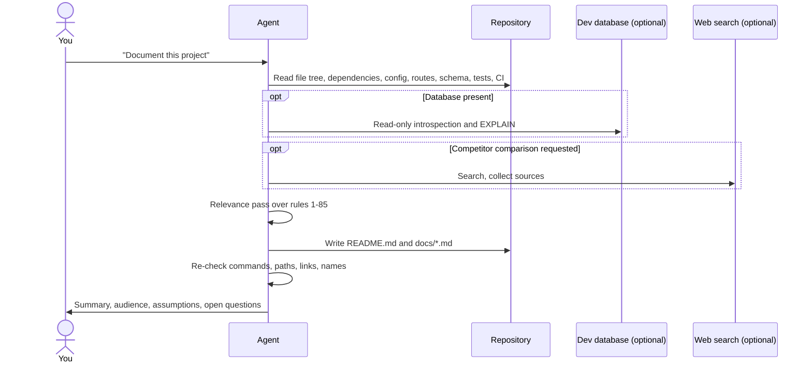

# Doc Maker guide

This guide shows how to get good documentation out of the `doc-maker`, `database-docs` and `architecture-docs` skills: how they are triggered, what to ask for, how to review the result, and how to change the rules. For installation, see the [README](README.md#install).

## Contents

1. [How the skills are triggered](#1-how-the-skills-are-triggered)
2. [What happens during a run](#2-what-happens-during-a-run)
3. [Prompt recipes](#3-prompt-recipes)
4. [Choose the audience](#4-choose-the-audience)
5. [Control the output](#5-control-the-output)
6. [Database documentation](#6-database-documentation)
7. [Review the result](#7-review-the-result)
8. [Keep docs up to date](#8-keep-docs-up-to-date)
9. [Customize the rules](#customize-the-rules)
10. [Troubleshooting](#10-troubleshooting)

---

## 1. How the skills are triggered

An agent loads only each skill's name and description at startup. When your request matches a description, the agent reads the full `SKILL.md` and follows it.

| Skill | Triggers on requests such as |
|-------|------------------------------|
| `doc-maker` | "document this project", "write / rewrite the README", "explain the architecture", "write developer / product / executive docs" |
| `database-docs` | "ER diagram", "document the schema", "data dictionary", "document the database", or when `doc-maker` finds a database |
| `architecture-docs` | "threat model", "role-permission matrix", "document our CI/CD / deployment / infrastructure", "sequence diagrams", "disaster recovery", "cost breakdown", "technical debt", or when `doc-maker` needs architecture or operations depth |

You can also call a skill directly:

| Install method | Command |
|----------------|---------|
| Plugin | `/doc-maker:doc-maker`, `/doc-maker:database-docs`, `/doc-maker:architecture-docs` |
| Manual copy or `npx skills` | `/doc-maker`, `/database-docs`, `/architecture-docs` |

Add your request after the command, for example `/doc-maker write a README for new contributors`.

---

## 2. What happens during a run



Expect the agent to read a lot of files before it writes anything. That is the point: it is collecting evidence. On a large repository, a full documentation set can take several minutes.

---

## 3. Prompt recipes

Copy a prompt and adjust it. Specific prompts give better results than "write docs".

### README only

```text
Write a README for this repository. Audience: developers who want to run it locally
in under 10 minutes. Keep it to one file.
```

### Full documentation set

```text
Create a full documentation set for this project: README plus focused docs under docs/.
Audience: a developer joining the team next week.
```

### Architecture only

```text
Write docs/ARCHITECTURE.md: components, how a request flows from input to output,
why each major component exists, and a sequence diagram for the main flow and one
failure flow.
```

### Design decisions (ADRs)

```text
Find the 5 most important engineering decisions in this codebase and write them as
ADRs in docs/DECISIONS.md. Use evidence from the code and git history.
```

### Competitor comparison

```text
Compare this project with its main alternatives in docs/COMPARISON.md. Use web search,
cite every source, and keep verified facts separate from your interpretation.
```

### Security review for docs

```text
Document authentication, authorization, secrets handling, input validation and the
main security risks with mitigations. Don't print any real secrets you find; list
the file and line instead.
```

### AI/ML project

```text
Document the ML pipeline in docs/ML.md: data sources, preprocessing, models, prompts,
evaluation method, hallucination risks and fallbacks. Say which metrics were actually
measured and which are not.
```

### Threat model and access control

```text
Write docs/SECURITY.md: the authentication and authorization model with sequence
diagrams, a role-permission matrix derived from the code, and a STRIDE threat model
with trust boundaries, mitigations and gaps. Reference secrets by file and line only.
```

### Infrastructure and delivery

```text
Write docs/INFRASTRUCTURE.md from our Dockerfiles, IaC and CI config: deployment
architecture, cloud resources, environments and how they differ, the CI/CD pipeline
from commit to production, and the rollback procedure.
```

### Disaster recovery runbook

```text
Document disaster recovery: state our RTO/RPO or say none are defined, list the
backups and replication that actually exist, and write step-by-step runbooks for
database loss, a bad deploy and leaked credentials. Mark recommendations separately.
```

### Cost and scaling

```text
Document our cost drivers and scalability strategy. Map each cost to the component
and billing unit, use dated official prices, and give formulas where usage is unknown.
Describe what breaks first at 10x and 100x load.
```

### Technical debt and future architecture

```text
Analyze technical debt and performance bottlenecks with file locations, impact, risk
and effort. Then propose a target architecture as a "proposed" diagram, with
incremental migration steps and ADRs for the big decisions.
```

### Keep docs in sync with code

```text
Create docs/MAINTAINING_DOCS.md that maps code areas to the docs that must change
with them, plus a pull-request checklist. Suggest CI checks we could add.
```

### Onboarding checklist

```text
Write a "first day" section in the README: prerequisites, setup, environment variables,
how to run tests, and fixes for the 5 most likely setup failures.
```

---

## 4. Choose the audience

State the audience in your request. The skill changes depth and emphasis to match.

| Audience | Emphasis | Typical length |
|----------|----------|----------------|
| **Developers** | Precise setup, architecture, APIs, data flow, tests, failure handling | Long, many code blocks and diagrams |
| **Product / business** | Problems solved, users, workflows, value, limitations | Medium, few code blocks |
| **Executives** | Business impact, high-level architecture, risks, strategic choices | Short, one diagram at most |
| **Open-source users** | What it is, why use it, install, quick start, examples, contributing | README first |

The agent tells you which audience it assumed when it hands the docs over. Correct it if that's wrong.

---

## 5. Control the output

Useful instructions to add to any prompt:

| You want | Add |
|----------|-----|
| One file only | "Keep everything in README.md." |
| A specific folder | "Write to `docs-draft/` and don't touch existing files." |
| Existing style | "Follow the conventions in the existing `docs/` folder." |
| Fewer sections | "Skip roadmap and competitor analysis." |
| A specific section | "Include a troubleshooting section." |
| No diagrams | "No Mermaid diagrams." |
| Plan first | "List the documents and sections you plan to write, and wait for my approval." |
| Documentation site | "Structure docs for MkDocs / Docusaurus with a sidebar config." |

---

## 6. Database documentation

`database-docs` works best when it can see every source of truth:

- Schema or DDL files, migrations, and ORM models
- Raw SQL and data-access code
- Configuration (connection settings, pool sizes) — with secrets left out
- A **local or staging** database, if you want live introspection

When a schema file, the live database and the code disagree (for example, a foreign key in the ORM that isn't in the database), the skill reports the difference instead of picking one. Relationships that the code relies on but the database doesn't enforce are labelled "logical, not enforced" in the ER diagram.

> [!WARNING]
> Don't give the agent production database credentials. The skill is written to stay read-only, but the safe setup is a development copy with no real personal data.

Example:

```text
Document our database in docs/DATABASE.md. Use the migrations in db/migrations and the
models in app/models. Include an ER diagram, a data dictionary with sensitivity labels,
and the indexes each important query uses.
```

---

## 7. Review the result

Always review AI-written documentation before you publish it. Check these first:

- [ ] **Commands run.** Copy the install and quick-start commands into a clean shell.
- [ ] **Paths and links exist.** Click every relative link.
- [ ] **Environment variables match the code.** Compare them with `.env.example` or the config loader.
- [ ] **Assumptions are labelled.** Search for "assumption" and confirm or fix each one.
- [ ] **Diagrams match reality.** Check that ER relationships match real foreign keys, and that architecture boxes match real services.
- [ ] **No secrets.** Search the output for keys, tokens, passwords and connection strings.
- [ ] **Claims are supported.** Remove words like "best", "fastest" or "production-ready" unless there is evidence for them.

Then review the diff:

```bash
git diff --stat
git diff
```

---

## 8. Keep docs up to date

The skills include rules for maintainability (rule 38) and automation (rule 39), so the docs name the code they depend on. To refresh them after a change:

```text
I changed the auth flow in src/auth/. Update every doc that describes authentication,
and list anything else that is now out of date.
```

```text
Check README.md and docs/ against the current code. List every mismatch first, then fix them.
```

A good habit: run the second prompt before each release.

---

<a id="customize-the-rules"></a>

## 9. Customize the rules

The rules are plain Markdown. To change them:

1. Fork this repository.
2. Edit the `SKILL.md` file under `skills/doc-maker/`, `skills/database-docs/` or `skills/architecture-docs/`.
3. Keep the YAML front matter at the top of each file valid:
   - `name`: lowercase letters, numbers and hyphens, the same as the folder name
   - `description`: what the skill does **and** when to use it, under 1024 characters. The agent uses this text to decide when to load the skill.
4. Validate the plugin:

   ```bash
   claude plugin validate --strict .
   ```

5. Raise `version` in `.claude-plugin/plugin.json`, then push. Plugin users receive the change when they run `claude plugin update doc-maker@doc-maker`.

Ideas for team-specific changes:

- Add your company's documentation template to the "Layout" step.
- Add required sections, such as an on-call runbook or a data-retention table.
- Remove rules your team never needs, such as competitor analysis for internal tools.

---

## 10. Troubleshooting

| Symptom | Cause | Fix |
|---------|-------|-----|
| Skill doesn't trigger | Request doesn't match the description | Call it directly with `/doc-maker` (or `/doc-maker:doc-maker` for the plugin) |
| Skill not listed after install | Plugin not loaded in the current session | Run `/reload-plugins`, or restart Claude Code. Check `claude plugin list` |
| Two copies of each skill | Installed as a plugin **and** copied into `~/.claude/skills/` | Keep one: uninstall the plugin, or delete the copied folders |
| `Plugin "doc-maker" not found in marketplace` | Marketplace not added | Run `claude plugin marketplace add TusharParlikar/doc-maker` first |
| Old rules after an update | Plugin version unchanged | Run `claude plugin update doc-maker@doc-maker` |
| Claude.ai rejects the upload | Zip doesn't contain the skill folder at its root | Zip the `doc-maker` folder itself, so the zip holds `doc-maker/SKILL.md` |
| Docs are too long | No audience or scope given | State the audience and the files you want (see [section 5](#5-control-the-output)) |
| Docs describe things that don't exist | Agent couldn't read the code, or guessed | Make sure the agent runs inside the repository. Ask it to list its evidence for each claim |
| Competitor section is thin | No web access | Turn on web search, or supply the competitor list yourself |
