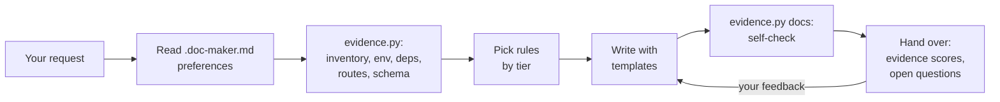

# Doc Maker: documentation skills for Claude and other AI agents

[](LICENSE)
[](#install)
[](https://agentskills.io)

Doc Maker makes an AI coding agent write documentation the way a careful engineer would: it collects evidence from the code first, writes only what the project needs, labels what it couldn't verify, and checks its own output before handing it over.

| Skill | Writes | Rules |
|-------|--------|-------|
| **`doc-maker`** | README, overview, features, quick start, configuration, architecture summary, tech stack, API/CLI reference, AI/ML pipeline, testing, ADRs, limitations, roadmap, comparison, glossary | D1-D20 |
| **`database-docs`** | Database choice, schema and data dictionary, ER diagram from real foreign keys, indexes, migrations, transactions, sensitive data, endpoint ↔ table mapping, lifecycle, backups | DB1-DB12 |
| **`architecture-docs`** | Auth and role matrix, threat model, components, sequence and state diagrams, deployment, cloud, CI/CD, integrations, caching, queues, monitoring, error handling, DR, scaling, cost, tech debt | A1-A19 |

Works in **Claude Code**, **Claude.ai**, **Claude Desktop**, and any agent that reads [Agent Skills](https://agentskills.io) (`SKILL.md`): Cursor, Codex, Gemini CLI, GitHub Copilot and others.

## Why it exists

AI-written docs tend to describe endpoints, flags and tables that don't exist, pad every README with the same twenty headings, and skip the "why". Doc Maker counters each of these:

- **Evidence script.** `scripts/evidence.py` (Python standard library, read-only) extracts routes, environment variables, dependencies, CI/container/IaC files and database schema, with `file:line` locations, before anything is written. It never prints secret values.
- **Self-check.** The same script checks the finished docs for broken links and anchors, commands that don't exist, endpoints that aren't in the code, and env vars the code never reads.
- **Tiers and budgets.** Tier 1 sections are always written, Tier 2 only when the project has the thing, Tier 3 only on request. README stays around 1,200-2,000 words.
- **Every rule says how to verify.** Each rule is *Look for → Verify → Output*, not just "document X".
- **Feedback loop.** After writing, the agent scores each section's evidence (high / medium / low), lists assumptions and open questions, and revises only the sections you name. Lasting preferences go in `.doc-maker.md`, written only with your approval.

## How it works



`doc-maker` loads `database-docs` when the project stores data, and `architecture-docs` when you ask for security, infrastructure or operations depth. Nothing is committed or published unless you ask.

## Install

**Claude Code plugin** (from your shell):

```bash
claude plugin marketplace add TusharParlikar/doc-maker
claude plugin install doc-maker@doc-maker
```

Or in a session (Claude Code v2.1.275+): `/plugin install doc-maker --marketplace TusharParlikar/doc-maker`. As a plugin, the skills are `/doc-maker:doc-maker`, `/doc-maker:database-docs` and `/doc-maker:architecture-docs`.

**Any agent** (Cursor, Codex, Gemini CLI, Copilot and others) with the [skills CLI](https://skills.sh):

```bash
npx skills add TusharParlikar/doc-maker
```

**Manual copy** (Claude Code): copy the folders in `skills/` into `~/.claude/skills/`, or into `<project>/.claude/skills/` for one project.

**Claude.ai / Claude Desktop:** download the three zips from the [latest release](https://github.com/TusharParlikar/doc-maker/releases/latest) and upload each under **Customize > Skills > + > Create skill > Upload a skill**. Code execution must be on (**Settings > Capabilities**). Without repository access, the skills can only use what you upload.

The evidence script needs Python 3.8+. Without Python, the agent gathers the same facts by reading files, which is slower and less thorough.

## Quick start

Ask in plain language inside your project:

| You ask | You get |
|---------|---------|
| "Write a README for this repo." | README with overview, features, quick start, configuration, architecture summary, limitations |
| "Our docs are stale. Check them against the code." | A list of mismatches first, then fixes |
| "Document our database." | `docs/DATABASE.md`: ER diagram matching real foreign keys, data dictionary, indexes, migrations |
| "Write a threat model and role-permission matrix." | `docs/SECURITY.md` with auth flows, roles × actions with enforcement locations, STRIDE table |
| "Document our deployment and CI/CD." | `docs/INFRASTRUCTURE.md` from Dockerfiles, IaC and CI config |

The `doc-maker` description excludes plain questions about code ("how does auth work here?"), and an eval case checks that it stays quiet. More recipes, the full rule index and troubleshooting are in **[GUIDE.md](GUIDE.md)**.

## How it compares

| If you need… | Best fit |
|--------------|----------|
| To explore an unfamiliar public repo right now, no setup | [DeepWiki](https://deepwiki.com), [Code Wiki](https://codewiki.google) |
| A hosted, customer-facing docs site | [Mintlify](https://mintlify.com) |
| Docs that warn you when the code they quote changes | [Swimm](https://swimm.io) |
| A schema reference that can never drift, regenerated in CI | [tbls](https://github.com/k1LoW/tbls), [SchemaSpy](https://schemaspy.org) |
| A README from one command | [readme-ai](https://github.com/eli64s/readme-ai) |
| A reviewed doc set in your repo: architecture, decisions, security, operations, database | Doc Maker |

Several pair well: let tbls generate the schema reference and `database-docs` explain it; let Doc Maker draft and Mintlify host. Full matrix, sources and where the alternatives are stronger: **[docs/COMPARISON.md](docs/COMPARISON.md)**.

## Proof

- **Free checks (CI on every push):** `python3 tests/test_evidence.py` runs the evidence script on synthetic repos and on the eval trap fixtures; `python3 tests/test_skills.py` checks rule IDs, cross-references and templates. The script was also checked against three real projects (an Express + Prisma API, a Flask + SQLAlchemy app, and the FastAPI full-stack template).
- **Behaviour evals:** [`evals/`](evals/README.md) has 7 cases for `claude plugin eval`, each compared with a no-plugin baseline: 3 real repositories pinned by commit, 3 trap repositories (stale docs, a missing feature, a hard-coded secret) and 1 must-not-trigger question. **Results will be published here once the suite has been run.**

## Limitations

- **Output varies between runs.** It's written by an LLM; review before you commit.
- **No automatic refresh.** Re-run it, or ask it to check the docs against the code before each release.
- **Route and schema extraction are heuristics** for common frameworks (Express, FastAPI, Flask, Django, Spring, Rails, Next.js; SQL, Prisma, Django, SQLAlchemy, SQLModel). Other stacks fall back to reading files.
- **Markdown only.** No hosting or search; pair it with MkDocs, Docusaurus or Mintlify.
- **Large repositories cost tokens and time.** Scope the request to a service or folder.

## Update and uninstall

| | Plugin | Manual copy |
|--|--------|-------------|
| Update | `claude plugin update doc-maker@doc-maker` | `git pull`, copy the folders again |
| Uninstall | `claude plugin uninstall doc-maker@doc-maker` | Delete the three folders from `~/.claude/skills/` |

Upgrading from 1.x? Rule numbers changed in 2.0: see [CHANGELOG.md](CHANGELOG.md) for the old → new mapping.

## Contributing

Issues and pull requests are welcome. Keep rules evidence-based and project-agnostic, in the *Look for → Verify → Output* format. Before a pull request, run:

```bash
python3 tests/test_evidence.py && python3 tests/test_skills.py && claude plugin validate --strict .
```

`skills/*/scripts/evidence.py` must stay identical in all three skills (the test checks this).

## License

[MIT](LICENSE) © Tushar Parlikar
