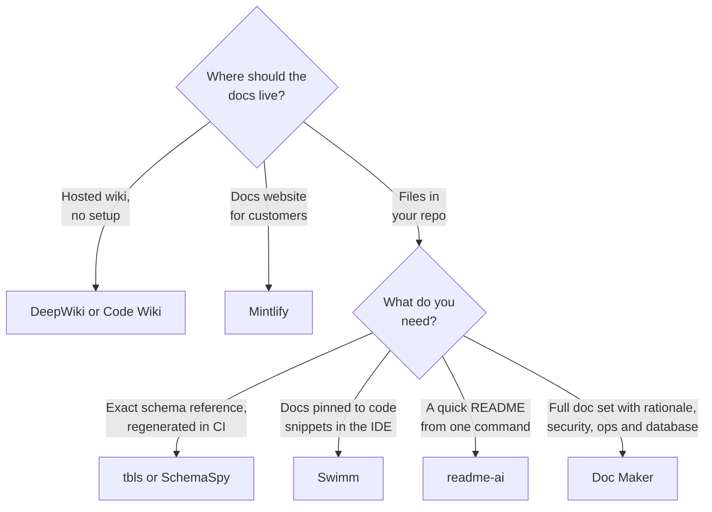
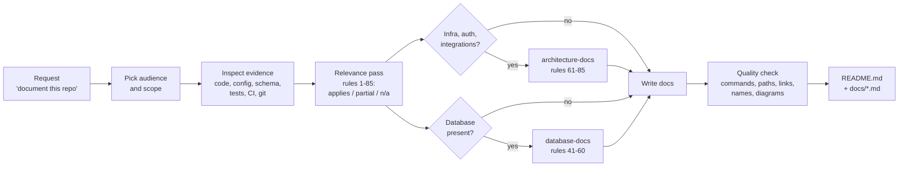

# Doc Maker: documentation skills for Claude and other AI agents

[](LICENSE)
[](#claude-code-plugin-recommended)
[](https://agentskills.io)

Doc Maker turns an AI coding agent into a careful technical writer. It reads the code before it writes anything, so the documentation it produces describes the project that exists rather than the one the agent imagines.

It ships three skills with 85 rules between them:

| Skill | What it documents | Rules |
|-------|-------------------|-------|
| **`doc-maker`** | README, overview, problem definition, architecture, tech stack, project structure, features, users and use cases, API, AI/ML pipeline, data flow, security, deployment, installation, configuration, performance, reliability, testing, observability, design decisions (ADRs), competitor comparison, limitations, roadmap, glossary | 1-40 |
| **`database-docs`** | Database type and version, schema, data dictionary, ER diagram built from the real schema, relationships and cascades, indexes, normalization, important queries, migrations, seed data, transactions, database security, backup and recovery, data lifecycle, app-to-database mapping, storage trade-offs | 41-60 |
| **`architecture-docs`** | Auth model, role-permission matrix, API-to-database mapping, entity lifecycle, sequence and component diagrams, deployment, cloud infrastructure, CI/CD, environments, dependency graph, integrations and third-party APIs, caching, queues and events, logging and monitoring, error handling, disaster recovery, scalability, cost, technical debt, threat model, performance bottlenecks, future architecture, doc change checklist | 61-85 |

Works with **Claude Code**, **Claude.ai**, **Claude Desktop**, and any agent that reads the open [Agent Skills](https://agentskills.io) `SKILL.md` format (Cursor, Codex, Gemini CLI, GitHub Copilot and others).

---

## Contents

- [Why Doc Maker](#why-doc-maker)
- [How it compares](#how-it-compares)
- [How it works](#how-it-works)
- [Install](#install)
- [Quick start](#quick-start)
- [What you get](#what-you-get)
- [Rule index](#rule-index)
- [Principles](#principles)
- [Limitations](#limitations)
- [Update and uninstall](#update-and-uninstall)
- [FAQ](#faq)
- [Contributing](#contributing)
- [License](#license)

For prompt recipes, workflows and troubleshooting, see **[GUIDE.md](GUIDE.md)**.

---

## Why Doc Maker

Documentation tends to fail in the same few ways:

| Problem | What it looks like | What Doc Maker does |
|---------|-------------------|---------------------|
| **Invented features** | AI-written docs describe endpoints, flags or tables that don't exist | Inspects source, config, schemas and tests first. Marks anything it can't verify as an assumption |
| **Template padding** | Every README has the same 20 headings, half of them empty or generic | Treats the 85 rules as a checklist. Writes only the sections the project needs and says why others don't apply |
| **Missing "why"** | Tech stacks listed with no reasoning, so nobody knows what is safe to change | Explains why each technology and design decision exists, with alternatives and trade-offs |
| **Hidden limitations** | Docs that oversell the project | Documents limitations, known issues and technical debt plainly |
| **Wrong diagrams** | ER diagrams with relationships the database doesn't have | Builds diagrams from the real schema and code, and flags differences between them |
| **Leaked secrets** | Real keys or connection strings copied into examples | Uses placeholders only, and never prints credentials or production data |

### When to use it

- You need a README or a full documentation set for an existing codebase.
- You are onboarding new developers and need architecture, data-flow and setup docs.
- You need database documentation: ER diagram, data dictionary, indexes, migrations.
- You need to explain a project to a different audience: developers, product, or executives.
- Your docs are out of date and need to be checked against the code.

### When not to use it

- **Projects with no code yet.** The skills document what exists; they are not a product-spec generator.
- **Marketing copy.** The skills avoid unsupported claims such as "best" or "fastest" by design.
- **API reference generation at scale.** For large public APIs, use a generator that reads your OpenAPI spec or docstrings (for example Swagger UI, Redoc, Sphinx or TypeDoc). Doc Maker can explain and link to that output.

---

## How it compares

Several tools already generate documentation from code. They solve different parts of the problem, and some work well together with Doc Maker. This section separates **facts** (from each project's own documentation, see [Sources](#sources)) from **interpretation** (marked as such).

### At a glance

| Tool | Type | Where docs live | Setup | Private code | Cost |
|------|------|-----------------|-------|--------------|------|
| **Doc Maker** | Skills for an AI agent | Markdown + Mermaid in your repo | Install plugin or copy folders | ✅ Works in your agent | Free (MIT) + your agent's usage |
| [DeepWiki](https://deepwiki.com) (Cognition) | Hosted AI wiki | deepwiki.com | None for public repos (swap `github.com` for `deepwiki.com`) | 🟡 Needs a Devin account | Free for public repos |
| [Code Wiki](https://codewiki.google) (Google) | Hosted AI wiki (Gemini) | codewiki.google | None for public repos | 🟡 CLI extension for private repos announced, waitlisted | Free public preview |
| [readme-ai](https://github.com/eli64s/readme-ai) | Open-source CLI | One `README.md` | `pip install readmeai` + LLM API key (or offline mode) | ✅ Runs locally | Free + LLM API usage |
| [Mintlify](https://mintlify.com) | Docs platform + AI agent | Hosted docs site, MDX in a docs repo | Account + GitHub app | ✅ Via GitHub app | Free Starter, paid Enterprise |
| [Swimm](https://swimm.io) | Code-coupled docs platform | `.swm` Markdown files in your repo | Account + IDE extension | ✅ | Paid, pricing on request |
| [tbls](https://github.com/k1LoW/tbls) / [SchemaSpy](https://schemaspy.org) | Schema doc generators | Markdown / HTML + ER diagrams | Binary + database connection | ✅ Runs locally | Free, open source |

With any AI-based tool, including Doc Maker, your code is still sent to the model provider that tool or agent uses.

### Feature matrix

✅ documented feature · 🟡 partial or needs extra setup · ❌ not a documented feature

| | Doc Maker | DeepWiki | Code Wiki | readme-ai | Mintlify | Swimm | tbls / SchemaSpy |
|:--|:--:|:--:|:--:|:--:|:--:|:--:|:--:|
| **What it covers** | | | | | | | |
| README | ✅ | ❌ | ❌ | ✅ | ❌ | ❌ | ❌ |
| Architecture overview + diagrams | ✅ | ✅ | ✅ | ❌ | 🟡¹ | 🟡 | ❌ |
| Design rationale (ADRs, trade-offs, when *not* to use) | ✅ | ❌ | ❌ | ❌ | 🟡¹ | ❌ | ❌ |
| Security: auth model, role matrix, threat model | ✅ | ❌ | ❌ | ❌ | 🟡¹ | ❌ | ❌ |
| Ops: CI/CD, environments, cloud, DR, cost | ✅ | ❌ | ❌ | ❌ | 🟡¹ | ❌ | ❌ |
| Database ER diagram + data dictionary | ✅ | ❌ | ❌ | ❌ | ❌ | ❌ | ✅ |
| API ↔ database mapping | ✅ | ❌ | ❌ | ❌ | ❌ | ❌ | ❌ |
| Competitor comparison with cited sources | ✅ | ❌ | ❌ | ❌ | ❌ | ❌ | ❌ |
| Audience modes (developer / product / executive) | ✅ | ❌ | ❌ | ❌ | ❌ | ❌ | ❌ |
| **How it keeps output accurate** | | | | | | | |
| Reads the actual code or schema | ✅ | ✅ | ✅ | ✅ | ✅ | ✅ | ✅ |
| Links claims to code locations | 🟡² | ✅ | ✅ | ❌ | ❌ | ✅ | n/a |
| Labels unverified claims as assumptions | ✅ | ❌ | ❌ | ❌ | ❌ | ❌ | n/a |
| Deterministic (same input, same output) | ❌ | ❌ | ❌ | ❌ | ❌ | ❌ | ✅ |
| **How it stays current** | | | | | | | |
| Updates automatically when code changes | ❌ | ✅ | ✅ | ❌ | ✅ | ✅ | ✅ in CI |
| Chat Q&A over the codebase | 🟡³ | ✅ | ✅ | ❌ | ❌ (docs only) | ✅ | ❌ |
| Hosted, searchable docs site | ❌ | ✅ | ✅ | ❌ | ✅ | ✅ | 🟡 static HTML |

¹ Mintlify's agent writes what you prompt it to write; these are not built-in document types.<br>
² Required for security, debt and bottleneck findings (file and line); not for every claim.<br>
³ Through the agent you run Doc Maker in, not a built-in chat.

### Which one fits?

*Interpretation, based on the facts above.*



| If you need… | Best fit | Why |
|--------------|----------|-----|
| To understand an unfamiliar public repo right now | DeepWiki, Code Wiki | Nothing to install; chat and diagrams over the code |
| A customer-facing docs website | Mintlify | Hosting, search and analytics are the product |
| Docs that warn you when the code they quote changes | Swimm | Docs are coupled to code snippets |
| A schema reference that can never drift | tbls, SchemaSpy | Deterministic and CI-friendly |
| A README in one command | readme-ai | Single-purpose CLI |
| A reviewed, versioned doc set: architecture, decisions, security, operations, database | Doc Maker | 85 rules covering the "why", with assumptions labelled |

### How Doc Maker is different

These are design differences, not quality claims. Judge the output on your own project.

- **It is a rule set, not a service.** Doc Maker runs inside the agent you already use (Claude Code, Claude.ai, Cursor, Codex, Gemini CLI). There is no account, server or extra API key, and the docs land in your repository where you review them in a pull request.
- **It covers the "why", not just the "what".** Code-reading wikis describe structure: modules, files, call graphs. Doc Maker also asks for the problem being solved, design decisions and trade-offs (ADRs), when *not* to use the project, limitations and a roadmap.
- **It is built against hallucination.** Rules require evidence for each claim, a label on anything unverified, and a quality pass that re-checks commands, paths and names against the code. Diagrams must match the real schema and services.
- **It writes for different readers.** The same codebase can produce developer docs, a product overview or an executive summary.
- **It goes deep on architecture and operations.** Twenty-five rules (61-85) cover what most generated docs skip: auth model and role-permission matrix, CI/CD and environments, cloud infrastructure, caching and queues, disaster-recovery runbooks, cost drivers, a STRIDE threat model, technical debt and a target architecture.
- **It goes deep on databases.** Twenty rules (41-60) add what schema tools don't: why the database was chosen, which queries each index serves, transaction boundaries, data lifecycle and security, with discrepancies between schema, ORM and code reported instead of guessed.

### Where the alternatives are stronger

- **Always up to date:** DeepWiki, Code Wiki, Mintlify, Swimm and tbls can refresh docs automatically. With Doc Maker, you re-run it (see [GUIDE.md](GUIDE.md#8-keep-docs-up-to-date)).
- **Zero setup:** DeepWiki and Code Wiki need only a URL for public repositories.
- **Repeatable output:** tbls and SchemaSpy produce the same result every run and can fail CI on schema drift. Doc Maker's output is LLM-generated and varies between runs.
- **Hosting and search:** Mintlify, DeepWiki and Code Wiki give you a website. Doc Maker writes Markdown only.

### Use them together

- **tbls or SchemaSpy + `database-docs`:** let the tool generate the exact schema reference in CI, and let Doc Maker explain the design, relationships and trade-offs around it.
- **Mintlify (or MkDocs, Docusaurus) + `doc-maker`:** let Doc Maker draft the content, and let the platform host it.
- **DeepWiki for exploring + Doc Maker for shipping:** use a hosted wiki to understand a repository, then use Doc Maker to write docs that live in it.

<a id="sources"></a>

**Sources** (checked October 2026; products change, so verify before relying on a detail):
[DeepWiki announcement](https://cognition.com/blog/deepwiki) ·
[DeepWiki guide (private repos)](https://codersera.com/blog/deepwiki-complete-developer-guide-2026/) ·
[Google Code Wiki coverage](https://www.theregister.com/2025/11/17/google_previews_code_wiki/) ·
[Code Wiki features](https://devops.com/google-code-wiki-aims-to-solve-documentations-oldest-problem/) ·
[Code Wiki private repo status](https://smartscope.blog/en/generative-ai/google-gemini/google-code-wiki-repository-documentation-guide/) ·
[readme-ai on PyPI](https://pypi.org/project/readmeai) ·
[Mintlify pricing review](https://www.featurebase.app/blog/mintlify-pricing) ·
[Mintlify agent docs](https://www.mintlify.com/docs/ai/agent) ·
[Swimm features](https://docs.swimm.io/features) ·
[Swimm sw.md format](https://swimm.io/blog/docs-as-code-understanding-swimm-sw-md-markdown-format/) ·
[tbls README](https://github.com/k1LoW/tbls) ·
[SchemaSpy docs](https://schemaspy.readthedocs.io/en/v6.0.0/)

---

## How it works



1. **Audience and scope.** The agent decides who the docs are for and what was asked for (a README only, or a full set).
2. **Evidence first.** It reads the file tree, entry points, dependency files, configuration, schemas, migrations, API routes, tests, CI and deployment files. It prefers read-only checks it can verify, such as running `--help`, running tests, or `EXPLAIN` on a query.
3. **Relevance pass.** It walks the rules and marks each one as applicable, partial, or not applicable with a reason.
4. **External facts.** For competitor comparisons or pricing, it searches the web and cites sources, or says the information isn't available.
5. **Write.** It writes a README with an overview and quick start, plus focused documents under `docs/` only where the project needs them.
6. **Quality check.** Before handing over, it re-checks numbers, commands, paths, links and names against the code, and makes terminology consistent.

The agent does not commit or publish the documentation unless you ask it to.

---

## Install

### Claude Code plugin (recommended)

From your shell:

```bash
claude plugin marketplace add TusharParlikar/doc-maker
claude plugin install doc-maker@doc-maker
```

Or inside a Claude Code session (requires Claude Code v2.1.275 or later):

```text
/plugin install doc-maker --marketplace TusharParlikar/doc-maker
```

On older versions, run the two steps inside the session:

```text
/plugin marketplace add TusharParlikar/doc-maker
/plugin install doc-maker@doc-maker
```

Check that it loaded:

```bash
claude plugin list
```

Installed as a plugin, the skills are namespaced as `/doc-maker:doc-maker`, `/doc-maker:database-docs` and `/doc-maker:architecture-docs`.

### Any agent (Cursor, Codex, Gemini CLI, Copilot and others)

Use the [skills CLI](https://skills.sh), which installs `SKILL.md` skills for many agents:

```bash
npx skills add TusharParlikar/doc-maker
```

Add `--skill doc-maker`, `--skill database-docs` or `--skill architecture-docs` to install only some of them.

### Claude Code: manual copy

```bash
git clone https://github.com/TusharParlikar/doc-maker.git
cp -r doc-maker/skills/* ~/.claude/skills/
```

To install for one project only, copy the folders into `<project>/.claude/skills/` instead. Commit them there and everyone who works on the project gets them.

On Windows (PowerShell):

```powershell
git clone https://github.com/TusharParlikar/doc-maker.git
Copy-Item -Recurse doc-maker\skills\* $HOME\.claude\skills\
```

### Claude.ai and Claude Desktop

1. Download `doc-maker.zip`, `database-docs.zip` and `architecture-docs.zip` from the [latest release](https://github.com/TusharParlikar/doc-maker/releases/latest).
2. In Claude, open **Customize > Skills**, click **+**, choose **Create skill > Upload a skill**, and upload each zip.

To build the zips yourself, zip each folder under `skills/` on its own. Each zip must contain the folder, with `SKILL.md` inside it:

```bash
cd skills
tar -a -cf doc-maker.zip doc-maker          # Windows 10+ (built-in tar)
zip -r database-docs.zip database-docs      # macOS / Linux (repeat for architecture-docs)
```

> [!NOTE]
> Custom skills on Claude.ai need code execution to be turned on: **Settings > Capabilities** on Free, Pro and Max, or **Organization settings > Plugins & skills** on Team and Enterprise. Without repository access, the skills can only document what you paste or upload into the chat.

---

## Quick start

Open your project and ask in plain language. The skills trigger from the request; you don't need special syntax.

```text
Write a README for this repo.
```

More examples:

| You ask | You get |
|---------|---------|
| "Document this project for new developers." | README + `docs/ARCHITECTURE.md`, setup, data flow, testing, glossary |
| "Generate an ER diagram and data dictionary for our database." | `docs/DATABASE.md` with a Mermaid `erDiagram` that matches the real foreign keys |
| "Explain this service to our leadership team." | Short executive overview: business value, high-level architecture, risks |
| "Write ADRs for the main design decisions." | `docs/DECISIONS.md` in Context / Problem / Options / Decision / Rationale / Trade-offs / Consequences format |
| "Write a threat model and role-permission matrix for this service." | `docs/SECURITY.md` with auth flow diagrams, a roles × actions matrix, and STRIDE threats with mitigations and gaps |
| "Document our deployment, CI/CD and environments." | `docs/INFRASTRUCTURE.md` from Dockerfiles, IaC and CI config, with deployment and pipeline diagrams |
| "Compare this project with its alternatives." | `docs/COMPARISON.md` with a matrix, sources, and verified facts kept apart from interpretation |
| "Our docs are stale. Check them against the code." | A list of mismatches, then corrected docs |

To call a skill directly, type `/doc-maker`, `/database-docs` or `/architecture-docs` (or `/doc-maker:doc-maker` and so on when installed as a plugin).

See [GUIDE.md](GUIDE.md) for more recipes.

---

## What you get

The default layout is a README that gives the overview and quick start, linking to focused documents. Only the documents the project needs are created, and existing documentation conventions are followed if the project has them.

```text
your-project/
├── README.md              Overview, problem, features, quick start, links
└── docs/
    ├── ARCHITECTURE.md    Components, data flow, sequence diagrams, tech stack rationale
    ├── DATABASE.md        Schema, ER diagram, data dictionary, indexes, migrations
    ├── SECURITY.md        Auth model, role-permission matrix, threat model
    ├── INFRASTRUCTURE.md  Deployment, cloud, environments, CI/CD, disaster recovery, scaling, cost
    ├── INTEGRATIONS.md    External services and third-party APIs
    ├── ML.md              Data, models, prompts, evaluation, limitations (AI/ML projects)
    ├── OPERATIONS.md      Configuration, logging and monitoring, failure handling, runbooks
    ├── TECH_DEBT.md       Technical debt and performance bottlenecks, prioritized
    ├── DECISIONS.md       Architecture decision records
    ├── MAINTAINING_DOCS.md  Which docs change when which code changes, PR checklist
    ├── COMPARISON.md      Competitors and alternatives, with sources
    └── GLOSSARY.md        Project-specific terms
```

Diagrams are written in [Mermaid](https://mermaid.js.org), which GitHub, GitLab and most documentation sites render natively.

---

## Rule index

The full text of each rule is in the skill files: [`skills/doc-maker/SKILL.md`](skills/doc-maker/SKILL.md), [`skills/database-docs/SKILL.md`](skills/database-docs/SKILL.md) and [`skills/architecture-docs/SKILL.md`](skills/architecture-docs/SKILL.md).

### `doc-maker` (rules 1-40)

| Area | Rules |
|------|-------|
| **Understanding the project** | 1 Good documentation · 2 Explain the project · 3 Pain points and problem definition · 4 Why, when and how to use |
| **Architecture and code** | 5 ER diagrams and data architecture · 6 System architecture · 7 Technology stack · 8 Project structure |
| **Product** | 9 Competitor analysis · 10 Feature breakdown · 11 Users and use cases · 36 Comparison matrix |
| **Interfaces and data** | 12 API documentation · 13 AI/ML documentation · 14 Data flow |
| **Running it** | 16 Deployment and infrastructure · 17 Installation and quick start · 18 Configuration |
| **Quality attributes** | 15 Security · 19 Performance and scalability · 20 Reliability and failure handling · 21 Testing · 22 Observability · 24 Security, privacy and compliance |
| **Decisions and future** | 23 Design decisions and trade-offs · 25 Limitations and known issues · 26 Roadmap · 37 Decision records (ADR) |
| **Presentation** | 27 Visual documentation · 28 Sequence and workflow diagrams · 29 Glossary · 30 README generation · 35 Professional presentation |
| **Integrity** | 31 Evidence-based documentation · 32 Consistency · 33 Audience adaptation · 34 Quality check · 38 Maintainability · 39 Documentation automation · 40 Final standard |

### `database-docs` (rules 41-60)

| Area | Rules |
|------|-------|
| **Structure** | 41 Database structure · 42 Schema documentation · 43 ER diagram · 44 Relationships · 57 Data dictionary |
| **Performance** | 45 Indexing · 46 Normalization · 47 Queries · 53 Performance |
| **Change and data** | 48 Migrations · 49 Seed and sample data · 54 Data lifecycle |
| **Integrity and safety** | 50 Transactions and integrity · 51 Database security · 52 Backup and recovery |
| **Architecture** | 55 Database-to-application mapping · 56 Database architecture diagram · 58 Trade-offs · 59 Multi-database architecture |
| **Verification** | 60 Validation against schema, ORM models, migrations, SQL and configuration |

### `architecture-docs` (rules 61-85)

| Area | Rules |
|------|-------|
| **Security** | 61 Authentication and authorization model · 62 Role-permission matrix · 82 Security threat model |
| **Structure and behaviour** | 63 API ↔ database mapping · 64 Entity lifecycle diagrams · 65 Sequence diagrams · 66 Component diagrams · 71 Dependency graph |
| **Infrastructure and delivery** | 67 Deployment architecture · 68 Cloud infrastructure · 69 CI/CD pipeline · 70 Environment architecture |
| **Integrations and runtime** | 72 External services and integrations · 73 Third-party APIs · 74 Caching · 75 Message queues and events · 76 Logging and monitoring · 77 Error handling |
| **Resilience, scale and cost** | 78 Disaster recovery · 79 Scalability strategy · 80 Cost architecture · 83 Performance bottleneck analysis |
| **Evolution** | 81 Technical debt analysis · 84 Future architecture · 85 Documentation change checklist |

---

## Principles

- **Evidence over assumption.** Every technical claim comes from the code, configuration or a check the agent ran. Anything else is labelled as an assumption.
- **Checklist, not template.** A rule is applied only when the project has the thing it covers. Sections that don't apply are named and explained in one line, not padded.
- **Honest about limits.** Limitations, known bugs and technical debt are documented, not hidden.
- **No secrets.** Real keys, tokens, passwords and production data never appear. Placeholders are used instead.
- **Read-only.** While documenting, the agent never writes, migrates or deletes data, and it does not commit unless asked.
- **Implemented vs recommended.** Suggested improvements (an index, a backup policy) are labelled as recommendations, separate from what exists.

---

## Limitations

- **Output varies between runs.** The docs are written by an LLM. Two runs on the same repository won't produce identical text. Review before you commit.
- **No automatic refresh.** Docs don't update when code changes; re-run the skill or add the refresh prompt from [GUIDE.md](GUIDE.md#8-keep-docs-up-to-date) to your release checklist.
- **Quality depends on the agent.** A stronger model and an agent that can run commands produce better-verified docs. On Claude.ai without repository access, the skill can only use what you upload.
- **Large repositories cost tokens and time.** Evidence gathering reads many files. On a large monorepo, scope the request to one service or folder.
- **Markdown only.** No hosting, search or versioned docs site. Pair it with MkDocs, Docusaurus or Mintlify if you need one.
- **Competitor facts age.** Comparisons use web search at the time of the run, and products change.

---

## Update and uninstall

| Action | Plugin install | Manual install |
|--------|----------------|----------------|
| Update | `claude plugin update doc-maker@doc-maker` | `git pull`, then copy the folders again |
| Uninstall | `claude plugin uninstall doc-maker@doc-maker` | Delete `doc-maker`, `database-docs` and `architecture-docs` from `~/.claude/skills/` |

---

## FAQ

**Does it work without a database?**
Yes. `database-docs` only runs when the project stores data. `doc-maker` states that no database is present.

**Does it connect to my production database?**
No, not unless you point it there. If a development database is available, it may run read-only introspection queries (such as `PRAGMA table_info` or `information_schema`) and `EXPLAIN`. It never writes data or prints credentials. Use a local or staging copy.

**Will it overwrite my existing docs?**
It follows your existing documentation layout and does not commit anything unless you ask. Review the changes with `git diff` before you commit. To keep existing files untouched, ask it to write to a new folder such as `docs-draft/`.

**Why are some sections missing from my README?**
By design. The skill only writes sections that apply to your project. Ask for a section by name if you want it.

**How much context does it use?**
About 540 tokens per session for the three skill descriptions. The full rules load only when a skill runs: about 3.8k tokens for `doc-maker`, 1.8k for `database-docs` and 3.8k for `architecture-docs` (measured with `claude plugin details doc-maker@doc-maker`).

**Can I change the rules?**
Yes. Fork the repository and edit the `SKILL.md` files. See [GUIDE.md](GUIDE.md#customize-the-rules).

---

## Contributing

Issues and pull requests are welcome.

- **Bug in the output?** Open an issue with the prompt you used, the kind of project (language, framework, database), and what was wrong.
- **New rule or change?** Keep rules evidence-based and project-agnostic. Add database rules to `database-docs`, architecture, infrastructure and operations rules to `architecture-docs`, and everything else to `doc-maker`.
- **Before you open a pull request**, run:

  ```bash
  claude plugin validate --strict .
  ```

## License

[MIT](LICENSE) © Tushar Parlikar
