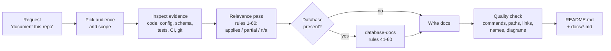

# Doc Maker: documentation skills for Claude and other AI agents

[](LICENSE)
[](#claude-code-plugin-recommended)
[](https://agentskills.io)

Doc Maker turns an AI coding agent into a careful technical writer. It reads the code before it writes anything, so the documentation it produces describes the project that exists rather than the one the agent imagines.

It ships two skills:

| Skill | What it documents | Rules |
|-------|-------------------|-------|
| **`doc-maker`** | README, overview, problem definition, architecture, tech stack, project structure, features, users and use cases, API, AI/ML pipeline, data flow, security, deployment, installation, configuration, performance, reliability, testing, observability, design decisions (ADRs), competitor comparison, limitations, roadmap, glossary | 1-40 |
| **`database-docs`** | Database type and version, schema, data dictionary, ER diagram built from the real schema, relationships and cascades, indexes, normalization, important queries, migrations, seed data, transactions, database security, backup and recovery, data lifecycle, app-to-database mapping, storage trade-offs | 41-60 |

Works with **Claude Code**, **Claude.ai**, **Claude Desktop**, and any agent that reads the open [Agent Skills](https://agentskills.io) `SKILL.md` format (Cursor, Codex, Gemini CLI, GitHub Copilot and others).

---

## Contents

- [Why Doc Maker](#why-doc-maker)
- [How it works](#how-it-works)
- [Install](#install)
- [Quick start](#quick-start)
- [What you get](#what-you-get)
- [Rule index](#rule-index)
- [Principles](#principles)
- [Update and uninstall](#update-and-uninstall)
- [FAQ](#faq)
- [Contributing](#contributing)
- [License](#license)

For prompt recipes, workflows and troubleshooting, see **[GUIDE.md](GUIDE.md)**.

---

## Why Doc Maker

Documentation tends to fail in the same few ways:

| Problem | What it looks like | What Doc Maker does |
|---------|-------------------|---------------------|
| **Invented features** | AI-written docs describe endpoints, flags or tables that don't exist | Inspects source, config, schemas and tests first. Marks anything it can't verify as an assumption |
| **Template padding** | Every README has the same 20 headings, half of them empty or generic | Treats the 60 rules as a checklist. Writes only the sections the project needs and says why others don't apply |
| **Missing "why"** | Tech stacks listed with no reasoning, so nobody knows what is safe to change | Explains why each technology and design decision exists, with alternatives and trade-offs |
| **Hidden limitations** | Docs that oversell the project | Documents limitations, known issues and technical debt plainly |
| **Wrong diagrams** | ER diagrams with relationships the database doesn't have | Builds diagrams from the real schema and code, and flags differences between them |
| **Leaked secrets** | Real keys or connection strings copied into examples | Uses placeholders only, and never prints credentials or production data |

### When to use it

- You need a README or a full documentation set for an existing codebase.
- You are onboarding new developers and need architecture, data-flow and setup docs.
- You need database documentation: ER diagram, data dictionary, indexes, migrations.
- You need to explain a project to a different audience: developers, product, or executives.
- Your docs are out of date and need to be checked against the code.

### When not to use it

- **Projects with no code yet.** The skills document what exists; they are not a product-spec generator.
- **Marketing copy.** The skills avoid unsupported claims such as "best" or "fastest" by design.
- **API reference generation at scale.** For large public APIs, use a generator that reads your OpenAPI spec or docstrings (for example Swagger UI, Redoc, Sphinx or TypeDoc). Doc Maker can explain and link to that output.

---

## How it works



1. **Audience and scope.** The agent decides who the docs are for and what was asked for (a README only, or a full set).
2. **Evidence first.** It reads the file tree, entry points, dependency files, configuration, schemas, migrations, API routes, tests, CI and deployment files. It prefers read-only checks it can verify, such as running `--help`, running tests, or `EXPLAIN` on a query.
3. **Relevance pass.** It walks the rules and marks each one as applicable, partial, or not applicable with a reason.
4. **External facts.** For competitor comparisons or pricing, it searches the web and cites sources, or says the information isn't available.
5. **Write.** It writes a README with an overview and quick start, plus focused documents under `docs/` only where the project needs them.
6. **Quality check.** Before handing over, it re-checks numbers, commands, paths, links and names against the code, and makes terminology consistent.

The agent does not commit or publish the documentation unless you ask it to.

---

## Install

### Claude Code plugin (recommended)

From your shell:

```bash
claude plugin marketplace add TusharParlikar/doc-maker
claude plugin install doc-maker@doc-maker
```

Or inside a Claude Code session (requires Claude Code v2.1.275 or later):

```text
/plugin install doc-maker --marketplace TusharParlikar/doc-maker
```

On older versions, run the two steps inside the session:

```text
/plugin marketplace add TusharParlikar/doc-maker
/plugin install doc-maker@doc-maker
```

Check that it loaded:

```bash
claude plugin list
```

Installed as a plugin, the skills are namespaced as `/doc-maker:doc-maker` and `/doc-maker:database-docs`.

### Any agent (Cursor, Codex, Gemini CLI, Copilot and others)

Use the [skills CLI](https://skills.sh), which installs `SKILL.md` skills for many agents:

```bash
npx skills add TusharParlikar/doc-maker
```

Add `--skill doc-maker` or `--skill database-docs` to install only one of them.

### Claude Code: manual copy

```bash
git clone https://github.com/TusharParlikar/doc-maker.git
cp -r doc-maker/skills/doc-maker doc-maker/skills/database-docs ~/.claude/skills/
```

To install for one project only, copy the folders into `<project>/.claude/skills/` instead. Commit them there and everyone who works on the project gets them.

On Windows (PowerShell):

```powershell
git clone https://github.com/TusharParlikar/doc-maker.git
Copy-Item -Recurse doc-maker\skills\* $HOME\.claude\skills\
```

### Claude.ai and Claude Desktop

1. Download `doc-maker.zip` and `database-docs.zip` from the [latest release](https://github.com/TusharParlikar/doc-maker/releases/latest).
2. In Claude, open **Settings > Capabilities > Skills** and upload each zip.

To build the zips yourself, zip each folder under `skills/` on its own. Each zip must contain the folder, with `SKILL.md` inside it:

```bash
cd skills
tar -a -cf doc-maker.zip doc-maker          # Windows 10+ (built-in tar)
zip -r database-docs.zip database-docs      # macOS / Linux
```

> [!NOTE]
> Skills on Claude.ai need code execution to be turned on for your account. Without repository access, the skills can only document what you paste or upload into the chat.

---

## Quick start

Open your project and ask in plain language. The skills trigger from the request; you don't need special syntax.

```text
Write a README for this repo.
```

More examples:

| You ask | You get |
|---------|---------|
| "Document this project for new developers." | README + `docs/ARCHITECTURE.md`, setup, data flow, testing, glossary |
| "Generate an ER diagram and data dictionary for our database." | `docs/DATABASE.md` with a Mermaid `erDiagram` that matches the real foreign keys |
| "Explain this service to our leadership team." | Short executive overview: business value, high-level architecture, risks |
| "Write ADRs for the main design decisions." | `docs/DECISIONS.md` in Context / Problem / Options / Decision / Rationale / Trade-offs / Consequences format |
| "Compare this project with its alternatives." | `docs/COMPARISON.md` with a matrix, sources, and verified facts kept apart from interpretation |
| "Our docs are stale. Check them against the code." | A list of mismatches, then corrected docs |

To call a skill directly, type `/doc-maker` or `/database-docs` (or `/doc-maker:doc-maker` when installed as a plugin).

See [GUIDE.md](GUIDE.md) for more recipes.

---

## What you get

The default layout is a README that gives the overview and quick start, linking to focused documents. Only the documents the project needs are created, and existing documentation conventions are followed if the project has them.

```text
your-project/
├── README.md              Overview, problem, features, quick start, links
└── docs/
    ├── ARCHITECTURE.md    Components, data flow, sequence diagrams, tech stack rationale
    ├── DATABASE.md        Schema, ER diagram, data dictionary, indexes, migrations
    ├── ML.md              Data, models, prompts, evaluation, limitations (AI/ML projects)
    ├── OPERATIONS.md      Deployment, configuration, observability, failure handling
    ├── DECISIONS.md       Architecture decision records
    ├── COMPARISON.md      Competitors and alternatives, with sources
    └── GLOSSARY.md        Project-specific terms
```

Diagrams are written in [Mermaid](https://mermaid.js.org), which GitHub, GitLab and most documentation sites render natively.

---

## Rule index

The full text of each rule is in the skill files: [`skills/doc-maker/SKILL.md`](skills/doc-maker/SKILL.md) and [`skills/database-docs/SKILL.md`](skills/database-docs/SKILL.md).

### `doc-maker` (rules 1-40)

| Area | Rules |
|------|-------|
| **Understanding the project** | 1 Good documentation · 2 Explain the project · 3 Pain points and problem definition · 4 Why, when and how to use |
| **Architecture and code** | 5 ER diagrams and data architecture · 6 System architecture · 7 Technology stack · 8 Project structure |
| **Product** | 9 Competitor analysis · 10 Feature breakdown · 11 Users and use cases · 36 Comparison matrix |
| **Interfaces and data** | 12 API documentation · 13 AI/ML documentation · 14 Data flow |
| **Running it** | 16 Deployment and infrastructure · 17 Installation and quick start · 18 Configuration |
| **Quality attributes** | 15 Security · 19 Performance and scalability · 20 Reliability and failure handling · 21 Testing · 22 Observability · 24 Security, privacy and compliance |
| **Decisions and future** | 23 Design decisions and trade-offs · 25 Limitations and known issues · 26 Roadmap · 37 Decision records (ADR) |
| **Presentation** | 27 Visual documentation · 28 Sequence and workflow diagrams · 29 Glossary · 30 README generation · 35 Professional presentation |
| **Integrity** | 31 Evidence-based documentation · 32 Consistency · 33 Audience adaptation · 34 Quality check · 38 Maintainability · 39 Documentation automation · 40 Final standard |

### `database-docs` (rules 41-60)

| Area | Rules |
|------|-------|
| **Structure** | 41 Database structure · 42 Schema documentation · 43 ER diagram · 44 Relationships · 57 Data dictionary |
| **Performance** | 45 Indexing · 46 Normalization · 47 Queries · 53 Performance |
| **Change and data** | 48 Migrations · 49 Seed and sample data · 54 Data lifecycle |
| **Integrity and safety** | 50 Transactions and integrity · 51 Database security · 52 Backup and recovery |
| **Architecture** | 55 Database-to-application mapping · 56 Database architecture diagram · 58 Trade-offs · 59 Multi-database architecture |
| **Verification** | 60 Validation against schema, ORM models, migrations, SQL and configuration |

---

## Principles

- **Evidence over assumption.** Every technical claim comes from the code, configuration or a check the agent ran. Anything else is labelled as an assumption.
- **Checklist, not template.** A rule is applied only when the project has the thing it covers. Sections that don't apply are named and explained in one line, not padded.
- **Honest about limits.** Limitations, known bugs and technical debt are documented, not hidden.
- **No secrets.** Real keys, tokens, passwords and production data never appear. Placeholders are used instead.
- **Read-only.** While documenting, the agent never writes, migrates or deletes data, and it does not commit unless asked.
- **Implemented vs recommended.** Suggested improvements (an index, a backup policy) are labelled as recommendations, separate from what exists.

---

## Update and uninstall

| Action | Plugin install | Manual install |
|--------|----------------|----------------|
| Update | `claude plugin update doc-maker@doc-maker` | `git pull`, then copy the folders again |
| Uninstall | `claude plugin uninstall doc-maker@doc-maker` | Delete `~/.claude/skills/doc-maker` and `~/.claude/skills/database-docs` |

---

## FAQ

**Does it work without a database?**
Yes. `database-docs` only runs when the project stores data. `doc-maker` states that no database is present.

**Does it connect to my production database?**
No, not unless you point it there. If a development database is available, it may run read-only introspection queries (such as `PRAGMA table_info` or `information_schema`) and `EXPLAIN`. It never writes data or prints credentials. Use a local or staging copy.

**Will it overwrite my existing docs?**
It follows your existing documentation layout and does not commit anything unless you ask. Review the changes with `git diff` before you commit. To keep existing files untouched, ask it to write to a new folder such as `docs-draft/`.

**Why are some sections missing from my README?**
By design. The skill only writes sections that apply to your project. Ask for a section by name if you want it.

**How much context does it use?**
About 300 tokens per session for the two skill descriptions. The full rules load only when a skill runs: about 3.8k tokens for `doc-maker` and 1.8k for `database-docs` (measured with `claude plugin details doc-maker@doc-maker`).

**Can I change the rules?**
Yes. Fork the repository and edit the `SKILL.md` files. See [GUIDE.md](GUIDE.md#customize-the-rules).

---

## Contributing

Issues and pull requests are welcome.

- **Bug in the output?** Open an issue with the prompt you used, the kind of project (language, framework, database), and what was wrong.
- **New rule or change?** Keep rules evidence-based and project-agnostic. Add database rules to `database-docs`, and everything else to `doc-maker`.
- **Before you open a pull request**, run:

  ```bash
  claude plugin validate --strict .
  ```

## License

[MIT](LICENSE) © Tushar Parlikar
