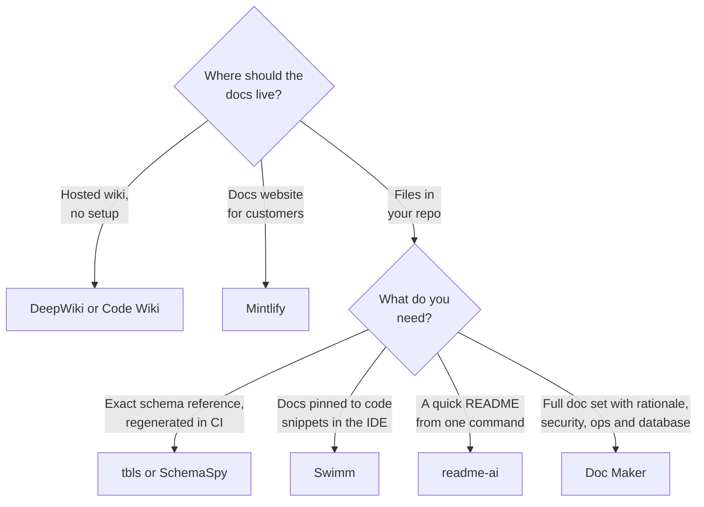

# How Doc Maker compares

Several tools already generate documentation from code. They solve different parts of the problem, and some work well together with Doc Maker. This section separates **facts** (from each project's own documentation, see [Sources](#sources)) from **interpretation** (marked as such).

## At a glance

| Tool | Type | Where docs live | Setup | Private code | Cost |
|------|------|-----------------|-------|--------------|------|
| **Doc Maker** | Skills for an AI agent | Markdown + Mermaid in your repo | Install plugin or copy folders | ✅ Works in your agent | Free (MIT) + your agent's usage |
| [DeepWiki](https://deepwiki.com) (Cognition) | Hosted AI wiki | deepwiki.com | None for public repos (swap `github.com` for `deepwiki.com`) | 🟡 Needs a Devin account | Free for public repos |
| [Code Wiki](https://codewiki.google) (Google) | Hosted AI wiki (Gemini) | codewiki.google | None for public repos | 🟡 CLI extension for private repos announced, waitlisted | Free public preview |
| [readme-ai](https://github.com/eli64s/readme-ai) | Open-source CLI | One `README.md` | `pip install readmeai` + LLM API key (or offline mode) | ✅ Runs locally | Free + LLM API usage |
| [Mintlify](https://mintlify.com) | Docs platform + AI agent | Hosted docs site, MDX in a docs repo | Account + GitHub app | ✅ Via GitHub app | Free Starter, paid Enterprise |
| [Swimm](https://swimm.io) | Code-coupled docs platform | `.swm` Markdown files in your repo | Account + IDE extension | ✅ | Paid, pricing on request |
| [tbls](https://github.com/k1LoW/tbls) / [SchemaSpy](https://schemaspy.org) | Schema doc generators | Markdown / HTML + ER diagrams | Binary + database connection | ✅ Runs locally | Free, open source |

With any AI-based tool, including Doc Maker, your code is still sent to the model provider that tool or agent uses.

## Feature matrix

✅ documented feature · 🟡 partial or needs extra setup · ❌ not a documented feature

| | Doc Maker | DeepWiki | Code Wiki | readme-ai | Mintlify | Swimm | tbls / SchemaSpy |
|:--|:--:|:--:|:--:|:--:|:--:|:--:|:--:|
| **What it covers** | | | | | | | |
| README | ✅ | ❌ | ❌ | ✅ | ❌ | ❌ | ❌ |
| Architecture overview + diagrams | ✅ | ✅ | ✅ | ❌ | 🟡¹ | 🟡 | ❌ |
| Design rationale (ADRs, trade-offs, when *not* to use) | ✅ | ❌ | ❌ | ❌ | 🟡¹ | ❌ | ❌ |
| Security: auth model, role matrix, threat model | ✅ | ❌ | ❌ | ❌ | 🟡¹ | ❌ | ❌ |
| Ops: CI/CD, environments, cloud, DR, cost | ✅ | ❌ | ❌ | ❌ | 🟡¹ | ❌ | ❌ |
| Database ER diagram + data dictionary | ✅ | ❌ | ❌ | ❌ | ❌ | ❌ | ✅ |
| API ↔ database mapping | ✅ | ❌ | ❌ | ❌ | ❌ | ❌ | ❌ |
| **How it keeps output accurate** | | | | | | | |
| Reads the actual code or schema | ✅ | ✅ | ✅ | ✅ | ✅ | ✅ | ✅ |
| Links claims to code locations | 🟡² | ✅ | ✅ | ❌ | ❌ | ✅ | n/a |
| Labels unverified claims as assumptions | ✅ | ❌ | ❌ | ❌ | ❌ | ❌ | n/a |
| Published results against a no-plugin baseline | 🟡⁴ | ❌ | ❌ | ❌ | ❌ | ❌ | n/a |
| Deterministic (same input, same output) | ❌ | ❌ | ❌ | ❌ | ❌ | ❌ | ✅ |
| **How it stays current** | | | | | | | |
| Updates automatically when code changes | ❌ | ✅ | ✅ | ❌ | ✅ | ✅ | ✅ in CI |
| Chat Q&A over the codebase | 🟡³ | ✅ | ✅ | ❌ | ❌ (docs only) | ✅ | ❌ |
| Hosted, searchable docs site | ❌ | ✅ | ✅ | ❌ | ✅ | ✅ | 🟡 static HTML |
| **Getting started** | | | | | | | |
| Works with no install (paste a URL) | ❌ | ✅ | ✅ | ❌ | ❌ | ❌ | ❌ |
| Works on private code with no extra account | ✅ | ❌ | ❌ | ✅ | ❌ | ❌ | ✅ |

¹ Mintlify's agent writes what you prompt it to write; these are not built-in document types. 
² `evidence.py` reports file:line for routes, env vars and schema, and findings cite file:line; ordinary prose claims are not linked one by one. 
³ Through the agent you run Doc Maker in, not a built-in chat. 
⁴ The eval suite (`evals/`) is in the repository; results will be published once it has been run.

## Which one fits?

*Interpretation, based on the facts above.*

| If you need… | Best fit | Why |
|--------------|----------|-----|
| To understand an unfamiliar public repo right now | DeepWiki, Code Wiki | Nothing to install; chat and diagrams over the code |
| A customer-facing docs website | Mintlify | Hosting, search and analytics are the product |
| Docs that warn you when the code they quote changes | Swimm | Docs are coupled to code snippets |
| A schema reference that can never drift | tbls, SchemaSpy | Deterministic and CI-friendly |
| A README in one command | readme-ai | Single-purpose CLI |
| A reviewed, versioned doc set: architecture, decisions, security, operations, database | Doc Maker | 51 rules covering the "why", backed by an evidence script, with assumptions labelled |

## How Doc Maker is different

These are design differences, not quality claims. Judge the output on your own project.

- **It is a rule set, not a service.** Doc Maker runs inside the agent you already use (Claude Code, Claude.ai, Cursor, Codex, Gemini CLI). There is no account, server or extra API key, and the docs land in your repository where you review them in a pull request.
- **It covers the "why", not just the "what".** Code-reading wikis describe structure: modules, files, call graphs. Doc Maker also asks for the problem being solved, design decisions and trade-offs (ADRs), when *not* to use the project, limitations and a roadmap.
- **It is built against hallucination.** A bundled script (`evidence.py`) extracts routes, env vars, dependencies and schema with file:line locations before anything is written, and checks the finished docs for broken links, missing commands and endpoints that aren't in the code. Rules require a label on anything unverified. The eval suite has trap repos that test exactly this.
- **It writes for different readers.** The same codebase can produce developer docs, a product overview or an executive summary.
- **It goes deep on architecture and operations.** Nineteen rules (A1-A19) cover what most generated docs skip: auth model and role-permission matrix, CI/CD and environments, cloud infrastructure, caching and queues, disaster-recovery runbooks, cost drivers, a STRIDE threat model, technical debt and a target architecture.
- **It goes deep on databases.** Twelve rules (DB1-DB12) add what schema tools don't: why the database was chosen, which queries each index serves, transaction boundaries, data lifecycle and security, with discrepancies between schema, ORM and code reported instead of guessed.

## Where the alternatives are stronger

- **Always up to date:** DeepWiki, Code Wiki, Mintlify, Swimm and tbls can refresh docs automatically. With Doc Maker, you re-run it (see [GUIDE.md](../GUIDE.md#8-keep-docs-up-to-date)).
- **Zero setup:** DeepWiki and Code Wiki need only a URL for public repositories.
- **Repeatable output:** tbls and SchemaSpy produce the same result every run and can fail CI on schema drift. Doc Maker's output is LLM-generated and varies between runs.
- **Hosting and search:** Mintlify, DeepWiki and Code Wiki give you a website. Doc Maker writes Markdown only.

## Use them together

- **tbls or SchemaSpy + `database-docs`:** let the tool generate the exact schema reference in CI, and let Doc Maker explain the design, relationships and trade-offs around it.
- **Mintlify (or MkDocs, Docusaurus) + `doc-maker`:** let Doc Maker draft the content, and let the platform host it.
- **DeepWiki for exploring + Doc Maker for shipping:** use a hosted wiki to understand a repository, then use Doc Maker to write docs that live in it.

**Sources** (checked October 2026; products change, so verify before relying on a detail):
[DeepWiki announcement](https://cognition.com/blog/deepwiki) ·
[DeepWiki guide (private repos)](https://codersera.com/blog/deepwiki-complete-developer-guide-2026/) ·
[Google Code Wiki coverage](https://www.theregister.com/2025/11/17/google_previews_code_wiki/) ·
[Code Wiki features](https://devops.com/google-code-wiki-aims-to-solve-documentations-oldest-problem/) ·
[Code Wiki private repo status](https://smartscope.blog/en/generative-ai/google-gemini/google-code-wiki-repository-documentation-guide/) ·
[readme-ai on PyPI](https://pypi.org/project/readmeai) ·
[Mintlify pricing review](https://www.featurebase.app/blog/mintlify-pricing) ·
[Mintlify agent docs](https://www.mintlify.com/docs/ai/agent) ·
[Swimm features](https://docs.swimm.io/features) ·
[Swimm sw.md format](https://swimm.io/blog/docs-as-code-understanding-swimm-sw-md-markdown-format/) ·
[tbls README](https://github.com/k1LoW/tbls) ·
[SchemaSpy docs](https://schemaspy.readthedocs.io/en/v6.0.0/)
