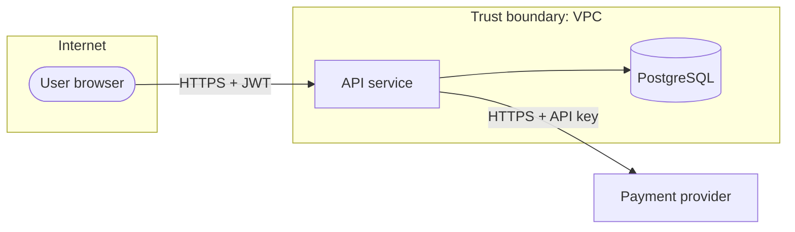

# Security templates: role-permission matrix and STRIDE threat model

## Role-permission matrix

Rows = resource and action. Columns = roles found in code, policy files or seed data. Cite where each check lives.

```markdown
| Resource / action | anonymous | user | admin | Enforced at |
|-------------------|:---------:|:----:|:-----:|-------------|
| `GET /orders/:id` | ❌ | ✅ own only | ✅ | `middleware/auth.ts:42`, `services/order.ts:88` |
| `DELETE /users/:id` | ❌ | ❌ | ✅ | `routes/users.ts:15` (`requireRole('admin')`) |
| `POST /export` | ❌ | ⚠️ checked in frontend only | ✅ | `web/src/Export.tsx:12`: no server check |
```

✅ allowed · ❌ denied · ✅ own only / same tenant = conditional · ⚠️ = finding (gap or inconsistency).

## STRIDE threat model

1. List assets (data, credentials, money, availability), actors, entry points and trust boundaries.
2. Draw a data-flow diagram with the trust boundaries as subgraphs.
3. Go through each element with STRIDE.



```markdown
| ID | Element | STRIDE | Threat | Likelihood | Impact | Existing mitigation (evidence) | Gap / recommendation |
|----|---------|--------|--------|-----------|--------|--------------------------------|----------------------|
| T1 | `POST /login` | Spoofing | Credential stuffing | High | High | bcrypt hashing (`auth/hash.ts:8`) | No rate limit found: **recommendation** add per-IP + per-account limits |
| T2 | Webhook `/payments/webhook` | Tampering | Forged payment events | Medium | High | Signature check (`webhook.ts:20`) | – |
```

STRIDE = Spoofing, Tampering, Repudiation, Information disclosure, Denial of service, Elevation of privilege. Never include working exploit steps or real secrets; reference file and line.
