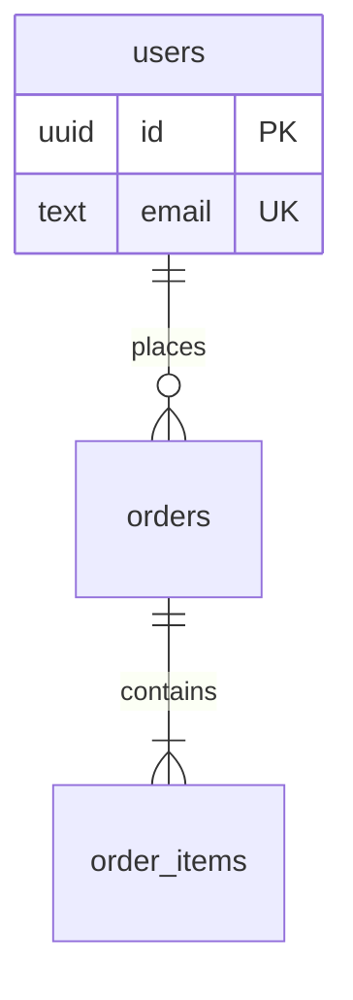

# Data dictionary and ER diagram template

Fill from `evidence.py schema` output plus the model and migration files. One section per important table. Never paste real rows; examples must be synthetic.

```markdown
## <table_name>

<One sentence: what one row represents.> Rows (dev copy): <count or "unknown">.

| Field | Type | Null | Default | Keys / constraints | Description | Example | Sensitivity |
|-------|------|------|---------|--------------------|-------------|---------|-------------|
| `id` | uuid | no | `gen_random_uuid()` | PK | Row identifier | `3f2a…` | – |
| `user_id` | uuid | no | – | FK → `users.id` ON DELETE CASCADE | Owner | `9b1c…` | internal |
| `email` | text | no | – | UNIQUE | Login email | `ana@example.com` | **PII** |

**Indexes:** `idx_<name>` (`col_a`, `col_b`): serves `<query or endpoint>`.
**Written by:** `<endpoint / job>` · **Read by:** `<endpoint / job>`
**Lifecycle:** created when <...>; updated when <...>; deleted <hard / soft via `deleted_at` / never>.
```

Sensitivity levels: `public`, `internal`, `PII`, `secret` (credentials, tokens, password hashes). Say which columns are encrypted at rest, if any, and how you know.

## ER diagram conventions



- Draw only relationships backed by a foreign key. For relationships the code relies on without a foreign key, add them with a label ending in `(logical, not enforced)`.
- Cardinality: `||--o{` one-to-many (optional), `||--|{` one-to-many (at least one), `||--||` one-to-one, `}o--o{` many-to-many (show the junction table instead when it has its own columns).
- More than ~12 tables: one overview diagram with names only, then one diagram per domain.
